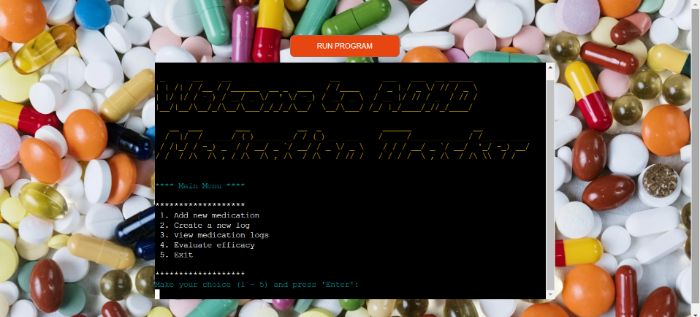

# Welcome to ADHD Medication Tracker
This project is a terminal-based Python application that supports adult users diagnosed with ADHD, in their medication intake and adjustment journey. It allows the user to make logs for every day; creating a history database of dosage changes, marks dose intake, efficacy, presence of side effects and their own observation. Additionaly the application calculates missed doses, amount of days with side effects, and tracks the efficacy of the medication over time.
This application is not only useful to those with ADHD, but also their caregivers, psychologist and psychiatrists that would aid in medication type and dose adjustment in ecery individual case.

***

***(Developed by Iryna Walsh)*** 

##[Go to the ADHD Medication Tracker Application]()

***

## Table of Contents: 
1. [**Development Phase**](#development-phase) 
    * [***About ADHD***](#about-adhd)
      * [*Goals*](#goals) 
      * [*User Stories*](#user-stories) 
2. [**Implementation Phase**](#implementation-phase) 
    * [***How to Use it***](#how-to-use-it) 
      * [*Menu*](#menu) 
      * [*Add Medication*](#add-medication) 
      * [*Create New Log*](#create-new-log) 
      * [*View Medication Logs*](#view-medication-logs)
      * [*Evaluate Medication Efficacy*](#evaluate-medication-efficacy)
    * [***Data Modeling***]
    * [***Possible Future Features***](#possible-future-features) 
3. [**Testing Phase**](#testing-phase) 
4. [**Deployment**](#deployment) 
5. [**Credits**](#credits) 
    * [**Python Libraries Used**](#python-libraries-used) 
    * [**Technologies Used**](#tchnologies-used) 
    * [***Code***](#code) 
    * [***Content***](#content) 
    * [***Media***](#media) 
    * [***Acknowledgements***](#acknowledgements) 

***

## **Development Phase:** 
### **About ADHD:** 
ADHD (Attention-Deficit/Hyperactivity Disorder) is a neurodevelopmental disorder that affects how a person thinks, behaves, and processes information.
It is characterized by executive dysfunction occasioning symptoms of inattention, hyperactivity, impulsivity and emotional dysregulation that are excessive and pervasive, impairing in multiple contexts of life. These symptoms can affect various aspects of life, including academic performance, work, relationships, and daily functioning.

**Diagnosis**: 
ADHD is usualy diagnosed in childhood, but there are many cases when some childrens symptoms can get overlooked. As a result these children learn to cope with the challanges of ADHD without detection. It is not until adulthood that these coping mechanisms start to fail and seeking diagnosis and symptom treatment is often a solution.
ADHD is diagnosed through a comprehensive evaluation by a healthcare professional, typically  psychologists and psychiatrists; the evaluation includes clinical interviews with the patient and their family, observation of behaviour, questionnaires and rating scales completed by those who interact closely with the individual.

**Treatment**: 
The ADHD symptoms can be managed with a combination of treatments: 
*Lifestyle Changes:*  - Regular physical activity, a balanced diet, a consistent sleep schedule, and minimizing distractions can also help individuals manage ADHD symptoms. 
*Behavioral Therapy:* - Behavioral interventions, including cognitive-behavioral therapy (CBT), can help individuals with ADHD develop coping strategies, improve executive function, and manage impulsive behaviors. 
*Medications:* - Stimulant medications (such as methylphenidate and amphetamines) are the most commonly prescribed, as they help increase the neurotransmitters like dopamine and norepinephrine in the brain.(which are paramount to the normal functioning of the brain) Non-stimulant medications (like atomoxetine) can also be perscribed for those individuals who do not respond well to stimulants.

With appropriate diagnosis and treatment, people with ADHD can lead successful and fulfilling lives, although managing the symptoms requires ongoing support and adjustments. 

#### **Goals:**
An ADHD medication tracker aims to help individuals with ADHD, their caregivers, and healthcare providers better manage and optimize medication treatment. 
Some of the key aims are:
- To help users track the medication changes and dose changes
- To show users  and healthcare practicioners the history of missed doses.
- Give users a place to track days with side effects and commenting on the experience in dedicated place.
- Aid healthcare practitioners track how well the medication is working for the individual.
- Encourage individuals with ADHD to take an active role in their treatment and decision-making.
- Maintain a detailed history of medication use and treatment adjustments.

#### **User Stories:** 
|No.|Story   | 
  |-  |--------| 
  |1  |**As a person with ADHD**,   I want to be able to created new medication files to which i can log daily logs and be encouraged to stay consistent     **I know I can do it when I can open the application and be able to add new medication and new daily logs with ease, without an option of backdating the logs.**|
  |2  |**As a person with ADHD**,   I want to see a daily log of my medication usage so that I can understand my medication patterns.    **I know I can do it when I can input the date of the log that I made and see all the details of the log in an ordered list.**| 
  |3  |**As a person with ADHD**,   I want to be able to record my daily dose intake, missed doses,the medication effectiness, side effect presence and comment on general experience    **I know I can do it if there is an easy and clearn input direction .**| 
  |4  |**As a psychiatrist**,   I want to track the effectiveness of different medications over time so I can optimize their treatment plan   **I know I can do it when I can access my patients medications logs .**| 
  |5  |**As a psychiatrist**,   I want to view my patients' medication adherence data, so I can evaluate their progress and treatment effectiveness.    **I know I can do it when I can access my patients medication efficacy, missed doses and side effect presence evaluations over sertain period of time.**| 
  

## **Implementation Phase:** 
### **How to Use it:** 
#### **Menu** 
#### **Add Medication**
#### **Create New Log**
#### **View Medication Logs**
#### **Evaluate Medication Efficacy**

### **Data Modeling:**

### **Possible Future Features** 

## **Testing Phase:** 

## **Deployment:** 
### **Local Deployment**
### **Deployment to Heroku:**

## **Credits:** 
### **Python Libraries Used** 
### **Technologies Used** 
- [GitHub](https://github.com/) - used to create, store and save the quiz building components. 
- [Git](https://git-scm.com/) - used for version control in the GitPod Terminal to Add, Commit and Push the code to GitHub 
- [Heroku](https://heroku.com/) - used to deploy the application.
- [Birme](https://www.birme.net/) - used to resize the images and format screenshots for README.md
- [LightHouse Google Extension](https://chromewebstore.google.com/detail/lighthouse/blipmdconlkpinefehnmjammfjpmpbjk?hl=en) - this Chrome Dev Tools was used to scan and generate performance statistic.
- [CI Python Linter](https://pep8ci.herokuapp.com/) - used to validate the python code by PEP8 standards to check for formating issues.
- [Google Sheets](https://workspace.google.com/intl/en_ie/products/sheets/) - Used the google sheets to store the data of the aplication
- [Google Cloud APIs](https://cloud.google.com/) - used to manage Google Sheets access

### **Code** 
The structure for the project was loosely based on the [Walkthrough project "Love Sandwiches"](), and used as a guideline only.

All the code is original and was developed through guidelies from:
- [Code Institute program](https://codeinstitute.net/ie/), especially on deployment, libraries and Using OAuth2 Authentication with Google APIs. 
- [W3 School on Python](https://www.w3schools.com/python/default.asp). 
- The following were consulted in the code creation from "Python Documentations":
  - [Python Exception handling](https://docs.python.org/3/tutorial/errors.html)
  - [Python Functions and Exception Handling](https://docs.python.org/3/tutorial/controlflow.html#defining-functions)
  - [Datetime Handling](https://docs.python.org/3/library/datetime.html)

Also through dynamic learning by reading solutions to problems of other budding developers on [Stack Overflow](https://stackoverflow.com/)

### **Content** 
The content and factual information on ADHD was taken from [Wikipedia article on ADHD](https://en.wikipedia.org/wiki/Attention_deficit_hyperactivity_disorder),  [Diagnostic and Statistical Manual of Mental Disorders (DSM-5)](https://repository.poltekkes-kaltim.ac.id/657/1/Diagnostic%20and%20statistical%20manual%20of%20mental%20disorders%20_%20DSM-5%20(%20PDFDrive.com%20).pdf) and [Mayo Clinic article on ADHD](https://www.mayoclinic.org/diseases-conditions/adult-adhd/symptoms-causes/syc-20350878) and paraphrased in own words.

All the other content in the ADHD Medication Tracker was created based on developers own journey with ADHD and personal experience with diagnosis procedures, and through peronal learning and development on the topic.

### **Media** 
Background image: 
[Photo from Pexels by cottonbro studio: assorted medicines](https://www.pexels.com/photo/flatlay-shot-of-assorted-medicines-5723612/
)

### **Acknowledgements**
I would like to give special appreciation to my husband Chris Walsh for his support and extra guidance with this project. 
- I also want to thank my mentor Daniel Hamilton, for giving great resources, guiding, teaching and supporting me through this project. 
- Also would like to thank Code Institute for their dedication to their students, wonderful educational material and valuable resources.           

