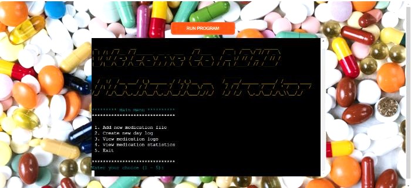
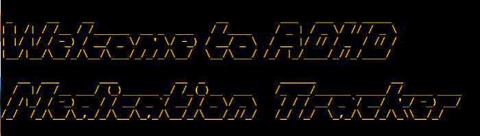
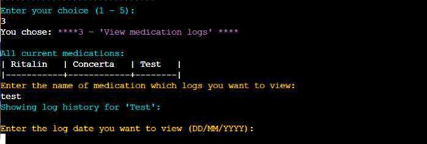
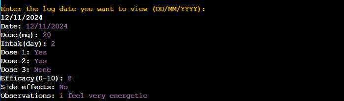
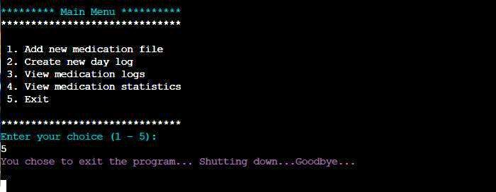

# Welcome to ADHD Medication Tracker
This project is a terminal-based Python application that supports adult users diagnosed with ADHD, in their medication intake and adjustment journey. It allows the user to make logs for every day; creating a history database of dosage changes, marks dose intake, efficacy, presence of side effects and their own observation. Additionaly the application calculates missed doses, amount of days with side effects, and tracks the efficacy of the medication over time.
This application is not only useful to those with ADHD, but also their caregivers, psychologist and psychiatrists that would aid in medication type and dose adjustment in ecery individual case.

***

***(Developed by Iryna Walsh)*** 

[Go to the ADHD Medication Tracker Application](https://adhd-medication-tracker-75ed2a4e3f76.herokuapp.com/)

***

## Table of Contents: 
1. [**Development Phase**](#development-phase) 
    * [***About ADHD***](#about-adhd)
      * [*Goals*](#goals) 
      * [*User Stories*](#user-stories) 
2. [**Implementation Phase**](#implementation-phase) 
    * [***How to Use it***](#how-to-use-it) 
      * [*Menu*](#menu) 
      * [*Add Medication*](#add-medication) 
      * [*Create New Log*](#create-new-log) 
      * [*View Medication Logs*](#view-medication-logs)
      * [*View Medication Statistics*](#view-medication-statistics)
      * [*Exiting the application*](#exiting-the-application)
    * [***Example Workflow***](#example-workflow)
    * [***Current Features***](#current-features)
    * [***Data Modeling***](#data-modeling)
    * [***Possible Future Features***](#possible-future-features) 
3. [**Testing Phase**](#testing-phase) 
4. [**Deployment**](#deployment)
    * [***Cloning & Forking***](#cloning--forking)
    * [***Local Deployment***](#local-deployment)
    * [***Remote Deployment to Heroku***](#remote-deployment-to-heroku)
5. [**Credits**](#credits) 
    * [**Python Libraries Used**](#python-libraries-used) 
    * [**Technologies Used**](#tchnologies-used) 
    * [***Code***](#code) 
    * [***Content***](#content) 
    * [***Media***](#media) 
    * [***Acknowledgements***](#acknowledgements) 

***

## **Development Phase:** 
### **About ADHD:** 
ADHD (Attention-Deficit/Hyperactivity Disorder) is a neurodevelopmental disorder that affects how a person thinks, behaves, and processes information.
It is characterized by executive dysfunction occasioning symptoms of inattention, hyperactivity, impulsivity and emotional dysregulation that are excessive and pervasive, impairing in multiple contexts of life. These symptoms can affect various aspects of life, including academic performance, work, relationships, and daily functioning.

**Diagnosis**: 
ADHD is usualy diagnosed in childhood, but there are many cases when some childrens symptoms can get overlooked. As a result these children learn to cope with the challanges of ADHD without detection. It is not until adulthood that these coping mechanisms start to fail and seeking diagnosis and symptom treatment is often a solution.
ADHD is diagnosed through a comprehensive evaluation by a healthcare professional, typically  psychologists and psychiatrists; the evaluation includes clinical interviews with the patient and their family, observation of behaviour, questionnaires and rating scales completed by those who interact closely with the individual.

**Treatment**: 
The ADHD symptoms can be managed with a combination of treatments: 
*Lifestyle Changes:*  - Regular physical activity, a balanced diet, a consistent sleep schedule, and minimizing distractions can also help individuals manage ADHD symptoms. 
*Behavioral Therapy:* - Behavioral interventions, including cognitive-behavioral therapy (CBT), can help individuals with ADHD develop coping strategies, improve executive function, and manage impulsive behaviors. 
*Medications:* - Stimulant medications (such as methylphenidate and amphetamines) are the most commonly prescribed, as they help increase the neurotransmitters like dopamine and norepinephrine in the brain.(which are paramount to the normal functioning of the brain) Non-stimulant medications (like atomoxetine) can also be perscribed for those individuals who do not respond well to stimulants.

With appropriate diagnosis and treatment, people with ADHD can lead successful and fulfilling lives, although managing the symptoms requires ongoing support and adjustments. 

#### **Goals:**
An ADHD medication tracker aims to help individuals with ADHD, their caregivers, and healthcare providers better manage and optimize medication treatment. 
Some of the key aims are:
- To help users track the medication changes and dose changes
- To show users  and healthcare practicioners the history of missed doses.
- Give users a place to track days with side effects and commenting on the experience in dedicated place.
- Aid healthcare practitioners track how well the medication is working for the individual.
- Encourage individuals with ADHD to take an active role in their treatment and decision-making.
- Maintain a detailed history of medication use and treatment adjustments.

#### **User Stories:** 
|No.|Story   | 
  |-  |--------| 
  |1  |**As a person with ADHD**,   I want to be able to created new medication files to which i can log daily logs and be encouraged to stay consistent     **I know I can do it when I can open the application and be able to add new medication and new daily logs with ease, without an option of backdating the logs.**|
  |2  |**As a person with ADHD**,   I want to see a daily log of my medication usage so that I can understand my medication patterns.    **I know I can do it when I can input the date of the log that I made and see all the details of the log in an ordered list.**| 
  |3  |**As a person with ADHD**,   I want to be able to record my daily dose intake, missed doses,the medication effectiness, side effect presence and comment on general experience    **I know I can do it if there is an easy and clearn input direction .**| 
  |4  |**As a psychiatrist**,   I want to view my patients' medication adherence data and track the effectiveness of different medications over time so I can optimize their treatment plan   **I know I can do it when I can access my patients medication efficacy, missed doses and side effect presence evaluations over sertain period of time.**| 

***  

## **Implementation Phase:** 
### ***Planning:***
The development of the aplication started with the flowchart creation which served as a rough idea for the flow of the commands and demonstartion of functionality.
The bellow flow of the functions was slightly changed and adjusted as the code was developed.

### **How to Use it:**
The ADHD Medication Tracker allows you to manage and track your ADHD medications effectively. This guide will walk you through how to use the application to add new medications, log daily intake, view medication logs, and calculate statistics to monitor your progress over time. 

#### **Menu** 
To start the application, run the Python script.It will display an ASCII art welcome message and present the main menu options. The primary menu options are: 
1. Add new medication file
2. Create new day log
3. View medication logs
4. View medication statistics
5. Exit

You must enter one of the above options in order to proceed.

#### **Option 1: Add Medication**
To add a new medication, follow these steps:
1. From the main menu, select option 1 to **Add new medication file**.
2. You will be prompted to enter the name of the medication.
     - Enter the name of the medication you want to track (e.g., "Adderall", "Ritalin").
     - If you enter a name that already exists, the program will notify you and list the existing medication names.
3. After adding the medication, a new worksheet is created with the medication's name. The worksheet will include the following headers for logging:
     - Date
     - Dose (mg)
     - Intake (day)
     - Dose 1
     - Dose 2
     - Dose 3
     - Efficacy
     - Side effects
     - Observations
4. Once the medication is added, you will be prompted to create a new log for the current day. If you do not want to create a log immediately,you can return to the main menu.

#### **Create New Log**
To log daily intake and medication details:
1. From the main menu, select option 2 to **Create new day log**.
2. You will be shown a list of current medications, and you will need to enter the medication name you wish to log.
3. After selecting the medication:
     - **Date**: The current date will be autofilled
     - **Dose (mg)**: Enter the perscribed dose of medication in (mg) (eg. 10mg, 18mg, etc.)
     - **Intake frequency**: Enter how many doses of medication you take per day (1-3).
     - **Doses taken**: For each dose you will be asked whether you took it or not.
     - **Efficacy**: Rate the effectivnes of medication in the current day from 0 to 10 (0= very ineffective to 10= very effective)
     - **Side effects**: You will be asked if you experienced side effects that day (yes or no)
     - **Observations**: Enter any personal notes or observations about the medication (max 20 words).
4. The log will be saved in Google Sheet for the future reference. Afterwards you will have an option to return to main menu or create anoter log.

#### **View Medication Logs**
To view medication logs for a specific date:
1. From the main menu, select option 3 to **View medication logs**.
2. You will be prompted to enter medication name which logs you want to view.
3. After selecting th mdication:
     - Enter the date in (DD/MM/YYYY) format you want to view.
     - Corresponding log entries for that date will be displayed
4. If the log with the selected date does not exist, you will be notified.

#### **View Medication Statistics**
To calculate and display medication statistics:
1. From the main menu, select option 4 to **View medication statistics**.
2. You will be prompted to enter medication name which statistics you want to generate/view.
3. The logs for the selected medication will then by analyzed, showing:
     - The number of days that were analysed.
     - The missed doses for each dose(1-3)  
     - The number of days with incomplete medication intake.
     - Avarage efficacy rating.
     - The number of days with side effects.
The statistic will be displayed in a clear format and its data stored in the "Results" worksheet in Google Sheets for future reference.

#### **Exiting the application**
To exit:
1. You can choose to exit the application from the main menu, by selecting option 5 **Exit** and also at any point in the process there are prompts that allow you to go back to main menu or exit by selection Option 1 or Option 2.
2. When choosing to exit, you will see a message of confirmation of your choise and goodbye.

### **Example Workflow:**
Here’s a typical sequence of how you might use the tracker: 
1. Run the application
2. **Add a new medication** (e.g., "Adderall").
3. **Log today's intake** for "Adderall":
     - Enter the dose (e.g., 20 mg).
     - Specify the number of doses taken (e.g., 1 dose).
     - Rate the efficacy (e.g., 8).
     - Mention any side effects (e.g., "None").
     - Enter a short observation (e.g., "Felt focused").
4. **View medication** logs to check your previous logs for "Adderall".
5. **View statistics** to get an overview of how well you are adhearing to your medication plan.

By following these steps, you can effectively track and analyze your ADHD medication usage over time.

## **Current Features:**
|Section: Feature Description |Evidence                                                     | 
|-------------|-------------------------------------------------------------|
|Main Menu:  Header and display of   all menu options:|  |
|Option 1:  Adding new   medications process:||
|Option 2:  Creating logs for multiple  medications; dose quantity changes  depending on frequency of intake:|      |
|Option 3:  Viewing log history by date:|   |
|Option 4:  Generating a statistic  based on medication logs:|   |
|Option 5:  Exiting the application:||
|Exit/ Return prompt:  Exit and Return to Menu  Prompt that pops up   after every function execution:|  |

### **Data Modeling:**
Google Sheets were used to store medication logs and statistics evaluation results. The name of the 
Google Sheet Spreadsheet is **adhd_medication_tracker**.

**'Results' Worksheet:** 
This worksheet is hidden from users visual access, when the user requests to see all medication in the application. When the statistic are generated, they get stored in this Googles Sheet Worksheet. 

**'Ritalin' Worksheet** 
'Ritalin' is the name of the medication. In this worksheet, all the logs related to this medication are stored. When the name of this worksheet is called and validated, the users completed log data is stored here.

**'Concerta' is another medication name. In this worksheet, all logs realted to this medication are stored. Same as in the above workheet, when the name "Concerta" is called by user in the application, it is validated to check that it exists, and the users log data is stored here.

Every time the user creates a new medication, a new worksheet is created in Google Sheets and log headings are autofilled.

### **Possible Future Features** 
1. **Deleting/Editing logs and medications:**
     - This feature would be very useful for the user in manaing medications and logs in the case of mistakes made in the logs or redundant medications.

2. **Multiple User Profiles**
     - Allow multiple user profiles in a single app, so different individuals (e.g., family members, caregivers) can track their own medications separately.

3. **User Name and Password Login**
     - So the user can create a secured environment for their sensitive information to be stored.

4. **Reminder Notifications**
     - Implement automated reminders via email or mobile notifications to prompt users to take their medication at specific times during the day.
     - To remind user to log their medication at the end of each day

5. **Medication Alerts**
     - Set up alerts for medication refill reminders or warnings when a user runs low on their medication.

6.  **Detailed Side Effects Log**
    - Allow users to select from a list of common side effects or enter custom symptoms, making it easier to track specific side effects across different medications.

7.  **Doctor and Healthcare Colaboration**
    - Allow users to share their medication logs and statistics with their GP, psychologist and psychiatrist; via email or integrated portal for remote monitoring and evaluations.

***
   
## **Testing Phase:** 
All testing related information can be found in [TESTING.md](TESTING.md)

***

## **Deployment:**
### **Local Deployment**
1. Register for a Gitpod account.
2. Install the Gitpod browser extension.
3. Use the link to acces the [P3-depoyment-template](https://github.com/Code-Institute-Org/python-essentials-template)
4. In the top right corner, locate and click on "Use this template" -> "Create a new repository"
5. Create a name and description for the project.(adhd-medication-tracker)
6. Go to KIrynaW/adhd-medication-tracker repository on GitHub.com
5. Click the "Open"(Gitpod) button located above the file list.
6. Install the [libraries](#python-libraries-used) required for the project in the terminal and update the requirements.txt file by entering "pip freeze > requirements.txt" into the terminal.

### **Remote Deployment to Heroku:**
1. Create a Heroku account.
2. Log in, then locate and click on "Dashbord"
3. Click on "New" -> "Create new app"
4. Choose an original name for your app and set your location to "Europe"
5. Go to the "Settings" tab.
6. Scroll down to "Config Vars" and click on "Reveal Config Vars."
7. Add a new config variable with **CREDS** as the key and the contents of your **Google API** credentials file as the value.
8. Add another config variable with **PORT** as the key and **8000** as the value.
9. Press the "Add buildpack" button; first add "Python" and then the "Node.js" buildpacks.
10. Exit the "Settings and go to the "Deploy" section.
1. Connect your Heroku app to your coresponding GitHub repository.
12. Click on **Deploy Branch** to manualy deploy the application.
Once deployed, Heroku will display the URL to access the Python terminal.

[Link to the final Deployment of ADHD Medication Tracker](https://adhd-medication-tracker-75ed2a4e3f76.herokuapp.com/) 

### **Cloning & Forking**
#### **Clone** 
1. Go to the chosen repository. 
2. Click on the "Code" green button on the top-ride side of the page. 
3. Select and Copy the HTTP (URL) 
4. Open the Git Terminal; change the current directory to the desired one where the cloned directory is to be placed. 
5. Input 'git clone' and after it the URL that was copied to look as following *git clone https://github.com/username/repository/* 
6. Click "Enter" to create a clone. 

#### **Fork** 
1. Log in to [GitHub](https://github.com/) 
2. Use navigation to locate [KIrynaW/adhd-medication-tracker](https://github.com/KIrynaW/adhd-medication-tracker) repository. 
3. In the top right corner of the page, locate "Fork" and click on it. 
4. In the "Repository Name" input window, create a new name that is different to the current or you can choose to keep the original. 
5. You can create a description of your Fork 
6. Scroll to the bottom of the page; in the bottom-right corner, click "Create Fork". 

### **Google Sheets & Google Cloud Platform**
The program uses Google Sheets to store medication, daily logs andresults of evaluation/statistics.
1. Sign up to a "Google Account" if you do not have one already.
2. Open "Google Sheets" and create a new spreadsheet.
3. Name the new spreadsheet **"adhd_medication_tracker"**
4. In your code, use the following to access the spreadsheet:

        SHEET = GSPREAD_CLIENT.open('adhd_medication_tracker')

5. Change the worksheet name to "Ritalin"
6. Your "Google Sheet" setup is now complete.

Next, you need to obtain **API credentials** from the [Google Cloud Platform](https://console.cloud.google.com/).

1. Create a new project and give it a name.
2. Fron navigation go to **APIs & Services**.
3. Click on **Library**.
4. Search for **Google Sheets API** and click **Enable**.
5. Next, search for **Google Drive API** and click **Enable**
6. Click on **Create Credentials** and from the dropdown, select **Google Drive API**.
7. Choose **Application Data** for data type.
8. click **Next**
9. Enter a Service Account name "ADHDMedicationTracker" and click **Create**
10. In th dropdown box choose **Basic** - **Editor** then click **Continue**
11. Go to the **Service Account** section in the credentials page.
12. Click the **Keys** tab, then click **Add Key** and choose **JSON**.
13. Download the **JSON** file and save it as **creds.json**.
14. Add the **creds.json** file to your .gitignore to prevent it from being shared publicly.

***

## **Credits:** 
### **Python Libraries Used** 
[colorama==0.4.6](https://pypi.org/project/colorama/) - used to colorcode the code input and print strings

[DateTime==5.5](https://pypi.org/project/DateTime/) - used to validate date input and output

[google-auth==2.36.0](https://pypi.org/project/google-auth/) - simplifies using Google’s various server-to-server authentication mechanisms to access Google APIs.

[google-auth-oauthlib==1.2.1](https://pypi.org/project/google-auth-oauthlib/) - provides oauthlib integration with google-auth.

[gspread==6.1.4](https://pypi.org/project/gspread/) - interface for working manipulating the Google Sheets.

[oauthlib==3.2.2](https://pypi.org/project/oauthlib/) - implements the logic of OAuth1 or OAuth2 without assuming a specific HTTP request object or web framework.

[pyasn1==0.6.1](https://pypi.org/project/pyasn1/) - implementation of ASN.1 types and codecs as a Python package.

[pyasn1_modules==0.4.1](https://pypi.org/project/pyasn1-modules/) - contains a collection of ASN.1 data structures expressed as Python classes based on pyasn1 data model.

[pyfiglet==1.0.2](https://pypi.org/project/pyfiglet/) - takes ASCII text and renders it in ASCII art fonts.

[pytz==2024.2](https://pypi.org/project/pytz/) - allows accurate and cross platform timezone calculations using Python 2.4 or higher. 

[requests-oauthlib==2.0.0](https://pypi.org/project/requests-oauthlib/) - provides first-class OAuth library support for Requests

[rsa==4.9](https://pypi.org/project/rsa/) - supports encryption and decryption, signing and verifying signatures, and key generation

[tabulate==0.9.0](https://pypi.org/project/tabulate/) - pretty-print the data to table format in the terminal

[zope.interface==7.1.1](https://pypi.org/project/zope.interface/) - provides an implementation of “object interfaces” for Python. 

### **Technologies Used** 
- [GitHub](https://github.com/) - used to create, store and save the quiz building components. 
- [Git](https://git-scm.com/) - used for version control in the GitPod Terminal to Add, Commit and Push the code to GitHub 
- [Heroku](https://heroku.com/) - used to deploy the application.
- [Birme](https://www.birme.net/) - used to resize the images and format screenshots for README.md
- [LightHouse Google Extension](https://chromewebstore.google.com/detail/lighthouse/blipmdconlkpinefehnmjammfjpmpbjk?hl=en) - this Chrome Dev Tools was used to scan and generate performance statistic.
- [CI Python Linter](https://pep8ci.herokuapp.com/) - used to validate the python code by PEP8 standards to check for formating issues.
- [Google Sheets](https://workspace.google.com/intl/en_ie/products/sheets/) - Used the google sheets to store the data of the aplication
- [Google Cloud Platform](https://cloud.google.com/) - used to manage Google Sheets access
- [FlowChart Maker](https://www.lucidchart.com/pages/examples/flowchart-maker) - used to create a flowchart in the project development

### **Code** 
The structure for the project was loosely based on the [Walkthrough project "Love Sandwiches"](), and used as a guideline only.

All the code is original and was developed through guidelies from:
- [Code Institute program](https://codeinstitute.net/ie/), especially on deployment, libraries and Using OAuth2 Authentication with Google APIs. 
- [W3 School on Python](https://www.w3schools.com/python/default.asp). 
- The following were consulted in the code creation from "Python Documentations":
  - [Python Exception handling](https://docs.python.org/3/tutorial/errors.html)
  - [Python Functions and Exception Handling](https://docs.python.org/3/tutorial/controlflow.html#defining-functions)
  - [Datetime Handling](https://docs.python.org/3/library/datetime.html)

Also through dynamic learning by reading solutions to problems of other budding developers on [Stack Overflow](https://stackoverflow.com/)

### **Content** 
The content and factual information on ADHD was taken from [Wikipedia article on ADHD](https://en.wikipedia.org/wiki/Attention_deficit_hyperactivity_disorder),  [Diagnostic and Statistical Manual of Mental Disorders (DSM-5)](https://repository.poltekkes-kaltim.ac.id/657/1/Diagnostic%20and%20statistical%20manual%20of%20mental%20disorders%20_%20DSM-5%20(%20PDFDrive.com%20).pdf) and [Mayo Clinic article on ADHD](https://www.mayoclinic.org/diseases-conditions/adult-adhd/symptoms-causes/syc-20350878) and paraphrased in own words.

All the other content in the ADHD Medication Tracker was created based on developers own journey with ADHD and personal experience with diagnosis procedures, and through peronal learning and development on the topic.

### **Media** 
Background image: 
[Photo from Pexels by cottonbro studio: assorted medicines](https://www.pexels.com/photo/flatlay-shot-of-assorted-medicines-5723612/
)

### **Acknowledgements**
I would like to give special appreciation to my husband Chris Walsh for his support and extra guidance with this project. 
- I also want to thank my mentor Daniel Hamilton, for giving great resources, guiding, teaching and supporting me through this project. 
- Also would like to thank Code Institute for their dedication to their students, wonderful educational material and valuable resources.           

