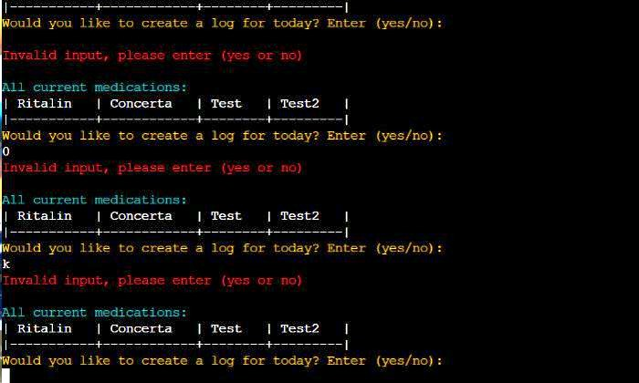

# Testing Page
## Table of Contents
 [**Testing Phase**](#testing-phase)
  * [***Bugs***](#bugs)
  * [***Validator Testing***](#validator-testing)
  * [***Accessibility Testing***](#accessibility-testing)
  * [***Manual Testing***](#manual-testing)
  * [***User Story Testing***](#user-story-testing)

  ***

  ## **Testing Phase:**
  ### **Bugs**

  ### **Validator Testing**

  

  ### **Accessibility Testing:**

  

  ### **Manual Testing**
  Test adding new medication:

  

  

  

  Testing creation of new logs: 
  

  

  Testing creation of data for logs:
  - Enter name and dose: 
      

  - Enter day itake: 
      

  - Enter First,second, third dose: 
      

  - Enter Efficacy: 
      

  - Enter side effects: 
      

  - Enter note: 
      

  Test viewing of log history:

  - Date validation: 
      

  - Results when existing date log is entered: 
      

  Test viewing the statistics:

  - Wrong medication input: 
      

  - Exit or Return prompt when wrong input: 
      

      

      

  ### **User Story Testing**