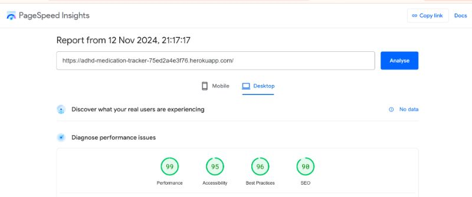
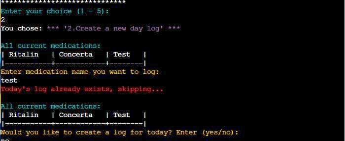
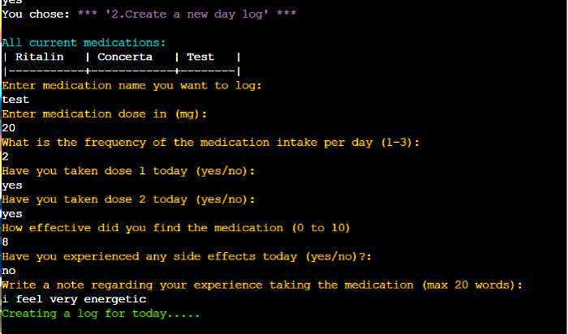
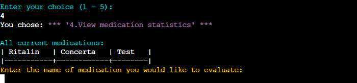
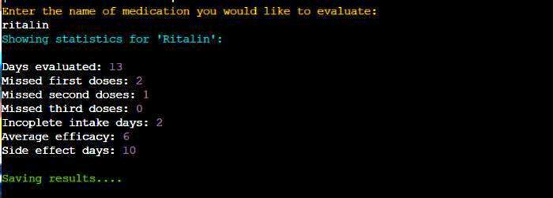

# Testing Page
## Table of Contents
 [**Testing Phase**](#testing-phase)
  * [***Solved Bugs***](#solved-bugs)
  * [***Validator Testing***](#validator-testing)
  * [***Accessibility Testing***](#accessibility-testing)
  * [***Manual Testing***](#manual-testing)
  * [***User Story Testing***](#user-story-testing)

  ***

  ## **Testing Phase:**
  ### **Solved Bugs**
  There were not many prominent, hard to solve bugs encountered in the creation of the ADHD Medication Tracker. 
  Throughout the creation of the code, there were various insignificant errors propping up, but were imediately handled.

  There is one bug that stood out though:

  **Statistics evaluation bug** 
  Issue :  
     - Errors started to occur due to the statistic evaluation results being printed directly in the existing medication worksheet. This led to conflict, as the data appended to the same sheet, cause disruption to the flow of the code and prevented other parts of the code from being correctly validated. 

  Solution:  
     - To resolve this, a separate sheet was created specifically for storing the statistical evaluation results, enduring that medication data remained unaffected. The new worksheet "Results" was created to handle and store all statistics related to the medication logs, such as missed doses, efficacy averages, and side effects. Additionally, the "Results" worksheet was hidden from the general view, preventing it from being mistakenly accessed as medication worksheet. this fix streamlined the data management process and eliminated eroors caused by the data overlap.

  ### **Validator Testing**

  The Python code was run through the [CI Python Linter](https://pep8ci.herokuapp.com/#), to check for conventional Pep8 standard of code. The validation was successfully completed without any errors.

  

  ### **Accessibility Testing:**

  There were minor chanes made to the html of the project, to add a background image and to centre the terminal. As a result we needed to confirm that it goes throuh accessibility validator without any problems.
  

  The application was also run though the W3C HTML validator and showed no errors in the code. result can be seen ["Here":](https://validator.w3.org/nu/?doc=https%3A%2F%2Fadhd-medication-tracker-75ed2a4e3f76.herokuapp.com%2F)

  ### **Manual Testing**
  |Menu Option   |  Description   |Pass/Fail|Evidence                                        | 
  |--------------|----------------|---------|------------------------------------------------|
  |Option 1   |Test adding new medication  inputting variety of invalid strings in order to trigger the error. All error handling performed as expected. |Pass|     |
  |Option 2    |Testing creation of new logs:  inputting variety of invalid strings in order to trigger the error. All error handling performed as expected.|Pass|  |
  |Option 2    |Testing creation of data for logs:  inputting variety of invalid strings in order to trigger the error. All error handling performed as expected.|Pass|Enter name and dose:     Enter day itake:     Enter First,second, third dose:     Enter Efficacy:     Enter side effects:     Enter note:  |
  |Option 3    |Test viewing of log history:  inputting variety of invalid strings in order to trigger the error.  All error handling performed as expected.|Pass|Date validation:     Results when existing date log is entered:  |
  |Option 4    |Test viewing the statistics:   inputting variety of invalid strings in order to trigger the error.  All error handling performed as expected.|Pass|Wrong medication input:  |
  |Option 5    |Exiting and Return/Exit prompts:  inputting variety of invalid strings in order to trigger the error.  All error handling performed as expected.|Pass|Exit or Return prompt when wrong input:      |

  ### **User Story Testing**

 |No. |Story                |Pass/Fail|Evidence                     | 
 |----|---------------------|---------|-----------------------------|
 |No.1|**As a person with ADHD**,   I want to be able to created new medication files to which i can log daily logs and be encouraged to stay consistent     **I know I can do it when I can open the application and be able to add new medication and new daily logs with ease, without an option of backdating the logs.**|Pass|The user is able to do it by selecting **Option 1** from the menu and creating a new medication by inputing the name of it and imedietly being prompted to create a new log without having to go back to main menu.The current date log is automatically generated and it is not possible to create a backdated log, which encourages the user to log every day    |
 |No.2|**As a person with ADHD**,   I want to see a daily log of my medication usage so that I can understand my medication patterns.    **I know I can do it when I can input the date of the log that I made and see all the details of the log in an ordered list.**|Pass|The user can access their log history by choosing **Option 3** in the main menu and inputing the date of the log they like to view. Then the user is shown all the details of their log for that day.    |
 |No.3|**As a person with ADHD**,   I want to be able to record my daily dose intake, missed doses,the medication effectiness, side effect presence and comment on general experience    **I know I can do it if there is an easy and clearn input direction .**|Pass|The user is able to do it by choosing an **Option 2** in the main menu, then inputing the medication they like to create the log for and filling all the relevant information to their medication intake. The data is then stored in the google sheets.  |
 |No.4|**As a psychiatrist**,   I want to view my patients medication adherence data and track the effectiveness of different medications over time so I can optimize their treatment plan   **I know I can do it when I can access my patients medication efficacy, missed doses and side effect presence evaluations over sertain period of time.**|Pass|The user can do it by accessing the link to the application from their patient. In the main menu, the user can select **Option 4**, then input the name of medication to evaluate, which then generates a result based on all the present logs and stores them in a google sheet worksheet called "Results"   
|
